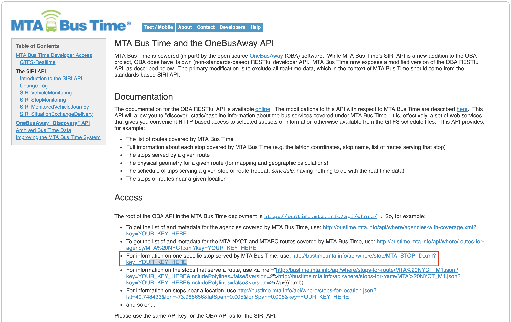

## A little data visualization exercise using Folium!
So I tried to fetch real time MTA bus locations and put it together with their routes and stations on a map. From first glance it does seem pretty straightforward, right? We know that there are MTA Bus Time API, TransitFeed API, and New York City has an abundance of open data. All we have to do is figure out how to use their API and put them together.

## Folium Base Map: Generating Base Map of Manhattan
```
def generateBaseMap(default_location=[40.793344, -73.9776387], default_zoom_start=11.2):
    base_map = folium.Map(width=450, height=600,location=default_location, control_scale=True, zoom_start=default_zoom_start, tiles='OpenStreetMap')
    return base_map
```
For the example, I will be only focusing on the Manhattan location. I've set the _coordinates_, _zoom level_, and _size_ of base map in this one function for my specific needs. If you have a different location in mind, adjust accordingly! Then go ahead and call the function
```
base_map = generateBaseMap()
base_map
```

## Fetching MTA Bus Locations: MTA Bus Time
1. Get API Key from [here](http://spreadsheets.google.com/viewform?hl=en&formkey=dG9kcGIxRFpSS0NhQWM4UjA0V0VkNGc6MQ#gid=0), store it somewhere safe.
2. Choose a bus route you want to monitor, get their real time bus coordinates using [SIRI VehicleMonitoring Call](http://bustime.mta.info/wiki/Developers/SIRIVehicleMonitoring). This example will choose bus route *M11*
```
ROUTE_ID = 'M11'
vMonitor = requests.get("http://bustime.mta.info/api/siri/vehicle-monitoring.json?key=%s&VehicleMonitoringDetailLevel=calls&LineRef=%s"%(YOUR_KEY, ROUTE_ID)).json()
buses = []
for i in vMonitor['Siri']['ServiceDelivery']['VehicleMonitoringDelivery'][0]['VehicleActivity']:
        buses.append([i['MonitoredVehicleJourney']['VehicleLocation']['Latitude'],i['MonitoredVehicleJourney']['VehicleLocation']['Longitude']])
```
3. Getting Bus Stop IDs
  ```
  stops = []
  for i in vMonitor['Siri']['ServiceDelivery']['VehicleMonitoringDelivery'][0]['VehicleActivity']:
      for s in i['MonitoredVehicleJourney']['OnwardCalls']["OnwardCall"]:
          stops.append(s['StopPointRef'])
  stops = [int(i.replace("MTA_", "")) for i in set(stops)]
  ```

4. Getting the bus stop coordinates and line routes <br>
<br>

  MTA Bus Time API have supposedly have this information, but the XML was too cluttered so I tried to find a simpler and cleaner source (before I decide to actually parse through that). <br>

  Lo and behold, the GIS Lab at the Newman Library of Baruch College, CUNY has provided the perfect data into our laps.

  [NYC Mass Transit Spatial Layers](https://www.baruch.cuny.edu/confluence/pages/viewpage.action?pageId=28016896)

  I'm using `bus_routes_nyc_may2019` and `bus_stops_nyc_may2019` to get the coordinates and PolyLines I need. Map the bus stop ID from step 3 to the coordinates from bus_stops_nyc_may2019 and voila, you have the coordinates.

  ```
  MTA_stops = gpd.read_file('bus_stops_nyc_may2019/bus_stops_nyc_may2019.shp')
  MTA_stops = gdf_stops.to_crs({'init': 'epsg:4326'})

  MTA_routes = gpd.read_file('bus_routes_nyc_may2019/bus_routes_nyc_may2019.shp')
  MTA_routes = MTA_routes.to_crs({'init': 'epsg:4326'})

  vStops = MTA_stops.loc[MTA_stops.stop_id.isin(stops)]
  ```

5. Integrating with our Folium Base Map: Buses, Routes, & Stops
  ```
  base_map = generateBaseMap()

  for i in buses:
      folium.Marker(i, icon=folium.CustomIcon(bus_img, icon_size=(20,20))).add_to(base)
  ```

  The geometry column from `bus_routes_nyc_may2019` shapefile may contain a `MultiLineString` or a `LineString`. This is to handle both cases.

  ```    
  for i in MTA_routes.loc[MTA_routes.route_id==route].geometry:
      if (type(i) == type(LineString([(0,0),(0,1)]))):
          tmp = []
          for x,y in list(i.coords):
              tmp.append((y,x))
          folium.PolyLine(tmp).add_to(base)
      else:
          for j in i:
              tmp = list(j.coords)
              tmp = [(tmp[0][1],tmp[0][0]),(tmp[1][1],tmp[1][0])]
              folium.PolyLine(tmp).add_to(base)

    for idx,row in vStops.iterrows():
      folium.vector_layers.CircleMarker((row.stop_lat, row.stop_lon), radius=5, popup=row.stop_name).add_to(base)

    base_map
    ```

<iframe width="450" height="600" src='img/tanyanabi_dv_mtabus.html'></iframe>


<!-- Millennial is a minimalist Jekyll theme. The purpose of this theme is to provide a simple, clean, content-focused blogging platform for your personal site or blog. Below you can find everything you need to get started. -->

<!-- ## Getting Started

[Getting Started]({{ site.github.url }}): getting started with installing Millennial, whether you are completely new to using Jekyll, or simply just migrating to a new Jekyll theme.

## Example Content

[Text and Formatting]({{ site.github.url }})

## Questions?

This theme is completely free and open source software. You may use it however you want, as it is distributed under the [MIT License](http://choosealicense.com/licenses/mit/). If you are having any problems, any questions or suggestions, feel free to [tweet at me](https://twitter.com/intent/tweet?text=My%20question%20about%20Millennial;via=paululele), or [file a GitHub issue](https://github.com/lenpaul/Millennial/issues/new).

## More Jekyll!

### Lagrange

Lagrange is a minimalist Jekyll blog theme that I built from scratch. The purpose of this theme is to provide a simple, clean, content-focused blogging platform for your personal site or blog.

Feel free to check out <a href="https://lenpaul.github.io/Lagrange/" target="_blank">the demo</a>, where you’ll also find instructions on <a href="https://lenpaul.github.io/Lagrange/journal/getting-started.html">how to use install</a> and use the theme.

### Portfolio Jekyll Theme

This is a Jekyll theme built using the [DevTips Starter Kit](http://devtipsstarterkit.com/) as a foundation for starting, and following closely the amazing tutorial by [Travis Neilson over at DevTips](https://www.youtube.com/watch?v=T6jKLsxbFg4&list=PL0CB3OvPhDA_STygmp3sDenx3UpdOMk7P). The purpose of this theme is to provide a clean and simple website for your portfolio. Emphasis is placed on your projects, which are shown front and center on the home page.

Everything that you will ever need to know about this Jekyll theme is included in [the repository](https://github.com/LeNPaul/portfolio-jekyll-theme), which you can also find in [the demo site](https://lenpaul.github.io/portfolio-jekyll-theme/).

### Jekyll Starter Kit

The Jekyll Starter Kit is a simple framework for starting your own Jekyll project using all of the best practices that I learned from building my other Jekyll themes.

Feel free to check out <a href="https://github.com/LeNPaul/jekyll-starter-kit" target="_blank">the GitHub repository</a>, where you’ll also find instructions on how to use install and use the theme. -->
